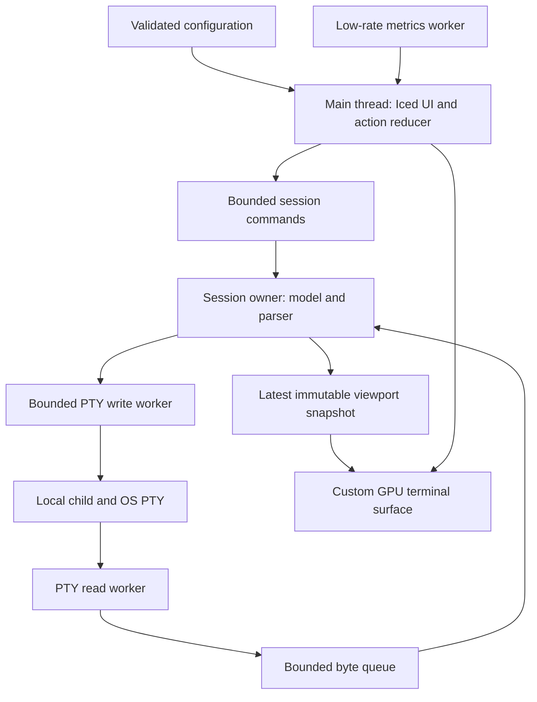

# Technical specification

## Product contract and scope

Build a local desktop application whose central experience is a terminal, with optional contextual panels. Default to one terminal, a compact session bar, and a collapsible CPU/memory panel. Use an original visual language: clear rectangular surfaces, restrained accent colors, typographic hierarchy, and optional edge lighting. Do not reproduce another product's screen composition, icons, wording, sounds, or animation choreography.

MVP includes one window; tabs and binary splits; at most eight live sessions and four visible terminal panes; working local shells; selection/copy/paste/search; font and palette settings; three original themes; settings UI; keybinding editor; layout persistence; a CPU/memory panel; reduced motion; and reliable close/error behavior. It must run on all three target OS families. Detailed compatibility tests live in [TERMINAL](TERMINAL.md) and [TESTING](TESTING.md).

Exclude from MVP: multiwindow, arbitrary docking, remote-session management, embedded SSH credentials, terminal image protocols, downloadable shaders, plugin marketplace, automatic updates, session-process resurrection, shell command recording, network maps, virtual keyboard, and ambient audio. Users can run their existing `ssh` CLI inside a terminal. Rich workflows mean responsive split sessions and optional lightweight effects, not a full desktop simulation.

## Architecture and ownership

One process owns the window, configuration, session managers, and render resources. Child shells are ordinary external OS processes, not sandboxed services. Keep main-thread work to input dispatch, small state changes, layout, and rendering. No PTY reads, file scanning, metrics collection, process waits, or blocking locks on that thread.

Start with separate modules in a small workspace, not one crate for each widget. Boundaries:

| Future module | Owns | Must not depend on |
|---|---|---|
| `terminal-core` | Core adapter, model commands, immutable snapshots, input encoding | GUI, GPU, clipboard APIs |
| `platform` | PTY backend, paths, process lifecycle and OS services | UI state, themes |
| `app::session` | Session scheduling, bounded channels, child status | GPU objects |
| `app::ui` | Action routing, settings, pane tree, focus | Direct PTY handles |
| `app::render` | Terminal glyph/cache/GPU work | Shell launch or config file writes |
| `app::config` | Schema, validation, migrations, persistence | PTY side effects |
| `app::panels` | Built-in panel registry and metrics view | Terminal parser internals |

Use `SessionId` with generation, `PaneId`, `SnapshotVersion`, and typed errors. Events for closed or previous-generation sessions are discarded. Only the session owner mutates the terminal model. Snapshot records hold viewport dimensions, version/resize epoch, visible cells or runs, cursor, selection, mode flags, and damage. Snapshot implementation may share immutable row storage; never clone full scrollback per frame. Account all retained row allocations, including evicted rows held by snapshots/search, in the per-session history budget. Permit at most two viewport snapshots and one 1 MiB search chunk per session; their bounded viewport/search overhead is separately accounted. Cancel search and release its chunk before allocating a replacement; if a consumer retains history, evict other rows or stop retaining additional history rather than exceed the budget. UI owns selection intent; the core owns selection coordinates and text extraction. Scrollback search operates on bounded immutable chunks off-thread, with versioned results and cancellation.

### Scheduling and resource boundaries

Per session, begin with blocking PTY read and write workers plus a model owner and lifecycle waiter, because their shutdown semantics are easier to inspect than an async FFI bridge. This is up to four worker threads per session; measure stack reservation/committed memory and idle overhead in M0. Consolidating owners into a fair scheduler is a later measured optimization, not an MVP prerequisite. UI framework tasks do not justify adding another async runtime.

Proposed limits: 256 KiB pending PTY output, 64 KiB ordinary input, 1 MiB explicit paste, 64 KiB single control-string payload, 10,000 scrollback lines and 32 MiB history budget per session (first limit reached wins), eight sessions, and a shared 64 MiB glyph atlas ceiling. Limits refer to accounted allocations, not promises about allocator RSS. Overlong OSC/DCS sequences must be discarded through the terminator without interpreting their remainder as a new command; prove the selected parser bounds these buffers or add a reviewed stateful limiter.

PTY bytes are never silently dropped to save work. Full output queues apply backpressure; user input has its own queue. Wakeups and snapshots can coalesce, not the bytes that construct terminal state. Model-to-writer enqueue is nonblocking. Reserve 16 KiB for protocol replies, separate from the 64 KiB user-input queue; service up to four replies then a user-input chunk when both are ready. A full user queue pauses paste/typing acceptance with a visible busy state; never silently discard accepted input. If required replies exceed their bounded reserve because the child will not read, mark the session failed with a protocol-backpressure error and initiate cancellable teardown, rather than block the model or grow memory. Continue output draining while cancellation proceeds. Work in bounded batches (initially 64 KiB or 2 ms) and service pending input/resizes between batches. Only the newest snapshot need be retained; if a renderer skips a version, compute damage against its actual version or invalidate the full viewport. A slow renderer cannot retain unbounded old snapshots.

Shutdown is an explicit state machine; a blocked read must be cancellable by closing owned handles or terminating the associated child. Never join a blocked worker on the GUI thread. Limits, timing and lifecycle assumptions must be exercised on ConPTY and Unix PTYs before feature work scales up.

## GPU and text architecture

Iced supplies the window integration, common widgets, and shared wgpu device. The terminal is a custom rendering primitive using that device/queue; do not create a second device or present loop. The exact stable Iced custom-primitive API and compatible text renderer versions are an M0 feasibility experiment, not assumed working code. If public integration cannot meet the gate, use the egui alternative in [DECISIONS](DECISIONS.md).

Render passes: opaque pane backgrounds; clipped cell backgrounds; glyphs; underline/strike/link decorations; selection and cursor; UI overlays. Optional decorative glow renders to a reduced-resolution offscreen target, then composites beneath crisp terminal text. Effects never blur glyphs or alter cell hit testing. No custom shader code from themes. Default effects are off; optional animation targets at most 30 Hz while terminal updates may reach display refresh.

Use instanced quads, persistent buffers, dirty rows, cached shaped runs, and a bounded shared atlas. Glyph cache keys include font identity, size, scale, glyph, and rasterization mode. Eviction invalidates corresponding draw data. Selection/cursor updates should not reshape unchanged lines. Recreate device resources on loss and restore from CPU snapshots, retaining shells. If device recovery fails, show a comprehensible error and allow orderly shutdown; a software terminal renderer is not promised for MVP.

Text shaping and rasterization happen on CPU, drawing/composition on GPU. Investigate the Iced text stack first; if the public API cannot draw grid-aligned shaped glyphs, evaluate a compatible glyphon/cosmic-text path. Do not use a paragraph widget per terminal cell. Terminal cell widths and positions come from emulation, not proportional glyph advances. Cluster-to-cell mapping must survive wide characters, combining marks, fallback fonts, and resize; ligatures off by default. UI prose can use normal shaping; terminal content remains in protocol cell order, with no automatic bidi rearrangement in MVP.

Compute device-pixel cell metrics consistently at fractional DPI. A resize epoch couples physical viewport, columns/rows, parser state, and PTY resize; stale snapshots may be temporarily letterboxed but never mixed with new hit-test metrics. Clamp to at least one row/column while hidden/minimized and suspend rendering of zero-size surfaces.

Wake redraws only for damage, cursor blink, interaction, active visible animations, or metrics changes. Pause animations and cursor timers when hidden. Limit metrics to once per second while visible and once per five seconds in the background; disable sampling when its panel is disabled. No idle polling at frame rate.

## UI and component contract

Represent layouts as a versioned tree of tab containers and horizontal/vertical splits, with stable pane IDs and ratios constrained to 0.1–0.9. Provide split, close, focus-next, zoom-pane, toggle-panel, and reset-layout actions through a command palette, menus, and editable shortcuts. Drag divider resizing is MVP; arbitrary docking is later. Enforce minimum visible pane sizes and provide overflow UI instead of clipping controls.

Use a typed `Action` registry for titles, shortcuts, menu items, enablement, and settings help. Route input in this order: active modal/IME composition, explicit application shortcuts in scope, focused widget, terminal encoding. Never intercept ordinary Ctrl+C for copy on Unix. Make default copy/paste platform-conventional and expose overrides with collision warnings.

Settings have searchable categories, descriptions, restore-default actions, live preview for safe appearance changes, Apply/Cancel for persistent edits, and clear restart/new-session badges. Invalid config retains the last valid state. Startup needs no wizard; missing shell/fonts/GPU produce actionable diagnostics.

All controls need keyboard focus, labels, visible focus indicators, high contrast, scalable text, and reduced motion. A custom terminal surface requires a separate accessible text representation and caret/selection mapping; GUI framework accessibility does not automatically make terminal output accessible. M0 tests OS accessibility feasibility; MVP has keyboard-complete navigation and bounded accessible text; production requires native screen-reader acceptance on the supported OS matrix. Announcements must be rate-limited and user-disableable.

## Extensibility without premature ABI

MVP panels are compile-time Rust components behind a registry: metadata, config validation, render/update methods, and subscriptions with cancellation. They receive scoped service handles, never raw terminal model references. Built-ins remain trusted application code. Add a second simple built-in panel in a test fixture to prove registration without editing terminal internals.

Theme files are data-only extensions. Do not stabilize a Rust dynamic-library ABI. Post-MVP compare subprocess JSON-RPC widgets against capability-limited WASM: subprocesses isolate crashes but are not an OS security sandbox; WASM needs resource limits and a carefully audited host API. Introduce versioned messages, permissions, resource quotas, cancellation, and compatibility policy before third-party executable extensions. No extension may silently inject shell input or read terminal contents.

## Resize transaction contract

The session owner sequences resize control alongside parser batches. Coalesce not-yet-started resize requests to the newest size. Compute proposed cell metrics first, then pause parsing at a batch boundary, request PTY resize through the platform adapter, and on success resize the model and publish a full-damage snapshot tagged with the new epoch. Output may accumulate in the bounded read queue while the resize is in flight; subsequent bytes parse against the new model. OS signal/output timing is not atomically knowable, so document this deterministic local ordering rather than claiming atomicity with the child.

The UI activates the new hit-test/caret metrics only when it receives the matching snapshot; during transition it letterboxes the old viewport and suspends pointer selection, while key input remains ordered. If PTY resize fails, keep old model/epoch and letterbox with a retryable error. If model resize fails after successful OS resize, fail and close the session rather than publish inconsistent coordinates. Each control operation is cancellable; if a platform resize stalls beyond 500 ms, surface an error and start session teardown without blocking the GUI. M0 must prove this cancellation mechanism; detached unbounded resize tasks are unacceptable. An in-flight resize completes before processing the newest pending request. Reject snapshots/selection actions from obsolete epochs.
